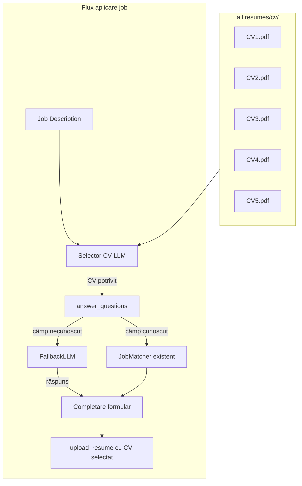

# Plan: Integrare LLM în Auto Job Applier LinkedIn

## 1. Arhitectura generală



---

## 2. Module noi și modificări

### 2.1 Modul FallbackLLM – `modules/fallback_llm.py` (NOU)

**Responsabilitate:** Clasă `FallbackLLM` care, la eroare la un provider, încearcă următorul (Groq → Gemini → Mistral → OpenRouter → HuggingFace).

**Structură cheie:**

- Dict `API_KEYS` cu cele 5 chei (hardcodate, conform cerinței; pentru producție se vor muta în `.env`)
- Metodă `generate(prompt, system_prompt) -> tuple[str, str]` (răspuns, nume provider)
- Provideri:
  - **Groq**: `OpenAI(base_url="https://api.groq.com/openai/v1")` + `llama-3.1-70b-versatile`
  - **Gemini**: `google.generativeai` (pachet `google-generativeai`), model `gemini-2.5-flash-exp`
  - **Mistral**: `mistralai.Mistral`, `mistral.chat.complete()` (nu `chat.completions`)
  - **OpenRouter**: `OpenAI(base_url="https://openrouter.ai/api/v1")` + `deepseek/deepseek-r1:free`
  - **HuggingFace**: `requests.post` la `https://api-inference.huggingface.co/models/{model}`; model `meta-llama/Llama-3.1-8B-Instruct`; răspuns: `response.json()[0]['generated_text']`

**Atentionare securitate:** Cheile vor fi introduse în cod conform cererii; trebuie adăugat `.env.example` și `.gitignore` pentru a evita commitul cheilor în viitor.

---

### 2.2 Modul Selector CV – `modules/cv_selector.py` (NOU)

**Responsabilitate:** Alege CV-ul cel mai potrivit din `all resumes/cv/` pe baza Job Description.

**Flux:**

1. Citește PDF-urile din `all resumes/cv/` (PyPDF2, deja în `requirements.txt`)
2. Extrage text din primele pagini (sau primele ~500 cuvinte) pentru fiecare CV
3. Construiește un prompt pentru LLM:

- Job Description (scurtat la ~1500 caractere)
- Lista de CV-uri cu sumar scurt (titlu/pagini/snippet)

1. LLM returnează numele fișierului recomandat (ex: `CV_supply_chain.pdf`)
2. Fallback: primul PDF din listă dacă LLM eșuează sau răspuns invalid

**Structură folder:** `all resumes/cv/CV1.pdf`, `CV2.pdf`, etc. (5 fișiere PDF)

**Integrare:** Funcție `select_best_resume(job_description: str, cv_folder: str = "all resumes/cv") -> str` care returnează path absolut către PDF.

---

### 2.3 Integrare în `runAiBot.py`

**Puncte de modificare:**

| Linie / zonă                  | Modificare                                                                                                                                                             |
| ----------------------------- | ---------------------------------------------------------------------------------------------------------------------------------------------------------------------- |
| **~2330–2340** (inițializare) | Nu mai seta `use_new_resume = False` doar dacă lipsește `default_resume_path`. Verifică existența `all resumes/cv/`; dacă există PDF-uri, activăm selectarea dinamică. |
| **~1968**                     | `description` vine din `get_job_description()` – deja disponibil                                                                                                       |
| **~2010–2015**                | **ÎNAINTE** de `answer_questions`: apel `select_best_resume(description)` → obține `resume_path` pentru acest job                                                      |
| **~2011**                     | Transmitere `job_description=description` la `answer_questions` – deja făcută                                                                                          |
| **~2013–2014**                | În loc de `upload_resume(modal, default_resume_path)`, folosește `upload_resume(modal, resume_path)` unde `resume_path` = rezultatul selectorului CV                   |
| **Fallback**                  | Dacă `select_best_resume` eșuează sau nu există CV-uri în `cv/`, folosește `default_resume_path` (`all resumes/default/resume.pdf`) ca în prezent                      |

---

### 2.4 Îmbunătățire răspunsuri la formulare (LLM pentru câmpuri necunoscute)

**Locație:** [runAiBot.py](runAiBot.py) – funcția `answer_questions` și [modules/smart_answers.py](modules/smart_answers.py).

**Strategie:** Păstrăm fluxul actual (JobMatcher, smart_match_question, get_contextual_answer). LLM intră doar când:

- `smart_text_answer` returnează `None` (câmp text necunoscut)
- `match_select_option` nu găsește opțiune (select)
- Răspunsul pentru radio nu se potrivește cu niciuna din opțiuni

**Nouă funcție:** `modules/llm_field_helper.py` (sau în `fallback_llm.py`):

- `ask_llm_for_field(question_label, field_type, options=None, context=...) -> str`
- **Context trimis la LLM:**
  - Date din `config/personals.PERSONALS`
  - Date din `config/questions.QUESTIONS_PERSONAL`
  - Job description (scurtat)
  - Tip câmp: `"select" | "radio" | "text"`
  - La select/radio: lista de opțiuni

**Prompt exemplu:**

```
You are filling a job application form. Use ONLY the candidate data below. For selects/radios, respond with EXACTLY one option from the list.

Candidate data: {PERSONALS + QUESTIONS_PERSONAL}
Job context: {job_description[:800]}

Question: "{question_label}"
Field type: {field_type}
Options (if any): {options}

Respond with ONLY the answer (one option or short text). No explanation.
```

**Integrare în `answer_questions`:**

- Când `smart_text_answer` e `None`, apel `ask_llm_for_field(...)`
- Dacă LLM returnează răspuns valid, folosește-l; altfel cădere pe `_get_text_answer_fallback` (linia ~1046)

---

## 3. Dependențe noi – `requirements.txt`

```
openai>=1.0.0
google-generativeai>=0.8.0
mistralai>=1.0.0
# requests - deja implicit
```

---

## 4. Configurare – `config/questions.py`

- **Resume paths:**
  - `default_resume_path = "all resumes/default/resume.pdf"` – păstrat ca fallback
  - Variabilă nouă: `resume_cv_folder = "all resumes/cv"` – folderul cu cele 5 CV-uri
- Dacă `resume_cv_folder` există și conține PDF-uri → selecție dinamică
- Dacă nu → se folosește `default_resume_path` ca acum

---

## 5. Ordinea implementării (TODO-uri)

1. **FallbackLLM** – creare [modules/fallback_llm.py](modules/fallback_llm.py) cu toate API-urile și chei
2. **CV Selector** – creare [modules/cv_selector.py](modules/cv_selector.py), extragere text PDF + logică de selecție
3. **LLM Field Helper** – funcție `ask_llm_for_field` pentru câmpuri necunoscute
4. **Integrare CV în runAiBot** – selectare CV înainte de `answer_questions` și folosire la `upload_resume`
5. **Integrare LLM în answer_questions** – apel LLM când JobMatcher/smart_answers nu găsesc răspuns
6. **Dependențe și folder** – actualizare `requirements.txt`, creare folder `all resumes/cv/` și verificare că cele 5 PDF-uri sunt prezente

---

## 6. Compatibilitate API – verificări specifice

| Provider    | Pachet                | Notă                                                                                                            |
| ----------- | --------------------- | --------------------------------------------------------------------------------------------------------------- |
| Groq        | `openai`              | `base_url="https://api.groq.com/openai/v1"`                                                                     |
| Gemini      | `google-generativeai` | `genai.configure()` + `GenerativeModel().generate_content()` – model poate fi `gemini-2.5-flash` sau echivalent |
| Mistral     | `mistralai`           | `Mistral()` + `chat.complete()`, nu `chat.completions`                                                          |
| OpenRouter  | `openai`              | `base_url="https://openrouter.ai/api/v1"`                                                                       |
| HuggingFace | `requests`            | POST la inference; tratare `generated_text` vs structure alternativă pentru modele chat                         |

---

## 7. Limitări și fallback-uri

- **Rate limits:** Pauză 2s între tentative la eșec (existent în exemplu)
- **Timeout:** 15–30s per provider înainte de trecere la următorul
- **CV lipsă:** Dacă `all resumes/cv/` este gol sau nu există → `default_resume_path`
- **LLM eșuat:** Păstrare `_get_text_answer_fallback` și răspuns aleator pentru select (comportament actual)

---

## 8. Structură finală folder CV

```
all resumes/
  default/
    resume.pdf          # fallback (existent)
  cv/
    CV1.pdf             # ex: supply chain
    CV2.pdf             # ex: operations
    CV3.pdf             # ex: project management
    ...
```

Utilizatorul va plasa cele 5 PDF-uri în `all resumes/cv/`. Numele fișierelor pot fi orice; LLM va primi lista de fișiere și va returna numele celui recomandat.
